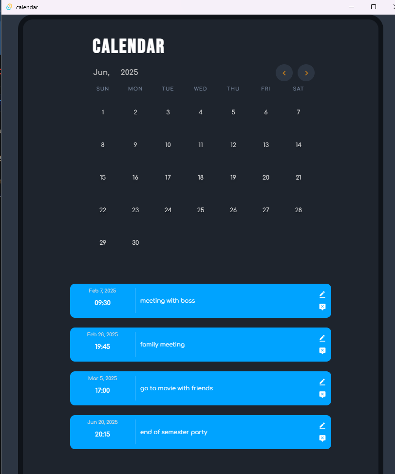
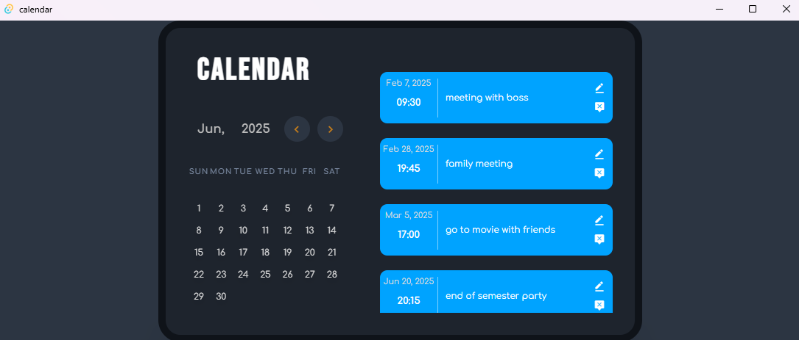

# Tauri + Vite + React + Sass

This is a simple, basic and beautifully designed calendar app built with Tauri, Vite, React, and Sass.

Easily download and use it on your local machine to stay organized and boost your productivity.

✨ Key Features:
✅ Write down your goals and track your progress effortlessly.
✅ Manage your reservations and receive timely reminders, so you never miss an important event.
✅ Enjoy a smooth, fast, and lightweight experience thanks to Tauri's efficient architecture.

Take control of your time—start planning smarter today! 🚀

## Recommended IDE Setup

- [VS Code](https://code.visualstudio.com/) + [Tauri](https://marketplace.visualstudio.com/items?itemName=tauri-apps.tauri-vscode) + [rust-analyzer](https://marketplace.visualstudio.com/items?itemName=rust-lang.rust-analyzer)
